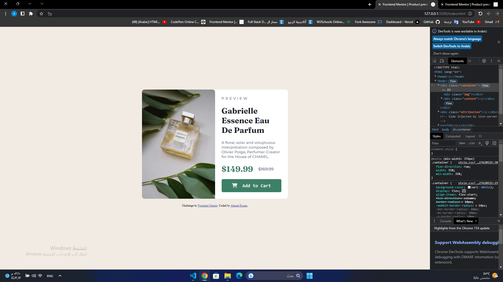
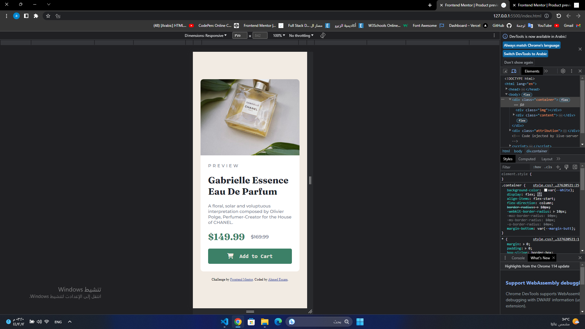

# Frontend Mentor - Product preview card component solution

This is a solution to the [Product preview card component challenge on Frontend Mentor](https://www.frontendmentor.io/challenges/product-preview-card-component-GO7UmttRfa). Frontend Mentor challenges help you improve your coding skills by building realistic projects. 

## Table of contents

- [Overview](#overview)
  - [The challenge](#the-challenge)
  - [Screenshot](#screenshot)
  - [Links](#links)
- [My process](#my-process)
  - [Built with](#built-with)
  - [What I learned](#what-i-learned)
- [Author](#author)

## Overview

### The challenge

Users should be able to:

- View the optimal layout depending on their device's screen size
- See hover and focus states for interactive elements

### Screenshot

### Links

- Solution URL: [Add solution URL here](https://github.com/Ah-Essam/card-component)
- Live Site URL: [Add live site URL here](https://card-component-gold.vercel.app/)

## My process

### Built with

- HTML5 
- CSS
- Flexbox

### What I learned

- how to make the img changes in the diffrance sizes by making a div and give it a difrance background photo in evry size

## Author

- facebook - [AhmedEssam](https://www.facebook.com/thestara7med)
- Frontend Mentor - [@Ah-Essam](https://www.frontendmentor.io/profile/Ah-Essam)